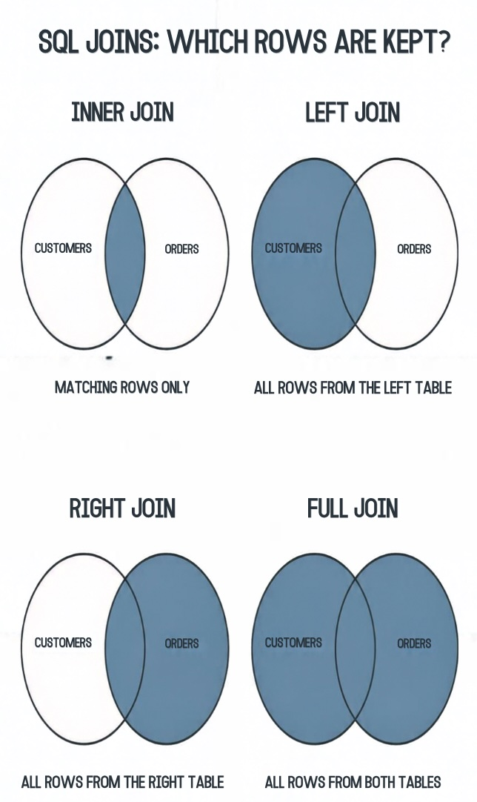

# SQL JOINs

## What are JOINs?

A JOIN is used when I need information from more than one table.

Databases usually store related information in separate tables. A JOIN allows me to connect those tables using a column that they have in common.

For example, in the Northwind database:

- `Customers` contains information about customers.
- `Orders` contains information about orders.
- Both tables contain `CustomerID`.

I can use `CustomerID` to connect a customer to their orders.

```sql
SELECT
    c.CompanyName,
    o.OrderID
FROM Customers AS c
INNER JOIN Orders AS o
    ON c.CustomerID = o.CustomerID;
```

The `ON` condition tells SQL which columns should be matched.

---

## How do JOINs work?

A JOIN combines rows from two or more tables based on a related column.

The basic structure is:

```sql
SELECT columns
FROM Table1
JOIN Table2
    ON Table1.CommonColumn = Table2.CommonColumn;
```

For example:

```sql
SELECT
    c.CompanyName,
    o.OrderID
FROM Customers AS c
INNER JOIN Orders AS o
    ON c.CustomerID = o.CustomerID;
```

Here:

- `Customers` is the first table.
- `Orders` is the second table.
- `CustomerID` connects the two tables.
- `c` and `o` are aliases used to make the query easier to read.
- `ON` defines how the rows should be matched.

### JOIN diagram



The main difference between JOIN types is **which rows SQL keeps in the result**.

---

## INNER JOIN

An `INNER JOIN` returns only rows where there is a match in both tables.

For example:

### Customers

| CustomerID | Name  |
| ---------- | ----- |
| 1          | Sarah |
| 2          | James |
| 3          | Aisha |

### Orders

| OrderID | CustomerID |
| ------- | ---------- |
| 101     | 1          |
| 102     | 1          |
| 103     | 2          |

If I use an `INNER JOIN`, Aisha is not returned because she does not have an order.

### Result

| Name  | OrderID |
| ----- | ------- |
| Sarah | 101     |
| Sarah | 102     |
| James | 103     |

### SQL example

```sql
SELECT
    c.Name,
    o.OrderID
FROM Customers AS c
INNER JOIN Orders AS o
    ON c.CustomerID = o.CustomerID;
```

**Easy way to remember:** only matching rows.

---

## LEFT JOIN

A `LEFT JOIN` keeps every row from the left table.

If there is no matching row in the right table, SQL returns `NULL` for the columns from the right table.

Using the same tables:

### Result

| Name  | OrderID |
| ----- | ------- |
| Sarah | 101     |
| Sarah | 102     |
| James | 103     |
| Aisha | NULL    |

Aisha is included because `Customers` is the left table.

### SQL example

```sql
SELECT
    c.Name,
    o.OrderID
FROM Customers AS c
LEFT JOIN Orders AS o
    ON c.CustomerID = o.CustomerID;
```

This is particularly useful when I want to find records that do not have a match.

For example, to find customers who have never placed an order:

```sql
SELECT
    c.Name
FROM Customers AS c
LEFT JOIN Orders AS o
    ON c.CustomerID = o.CustomerID
WHERE o.OrderID IS NULL;
```

**Easy way to remember:** keep everything from the left table.

---

## RIGHT JOIN

A `RIGHT JOIN` keeps every row from the right table.

If there is no matching row in the left table, SQL returns `NULL` for the columns from the left table.

For example:

### Customers

| CustomerID | Name  |
| ---------- | ----- |
| 1          | Sarah |
| 2          | James |
| 3          | Aisha |

### Orders

| OrderID | CustomerID |
| ------- | ---------- |
| 101     | 1          |
| 102     | 1          |
| 103     | 2          |
| 104     | 4          |

Order `104` does not have a matching customer.

A `RIGHT JOIN` keeps the order anyway.

### Result

| Name  | OrderID |
| ----- | ------- |
| Sarah | 101     |
| Sarah | 102     |
| James | 103     |
| NULL  | 104     |

### SQL example

```sql
SELECT
    c.Name,
    o.OrderID
FROM Customers AS c
RIGHT JOIN Orders AS o
    ON c.CustomerID = o.CustomerID;
```

In practice, I would normally use a `LEFT JOIN` instead by putting the table I want to keep on the left. This is often easier to read.

**Easy way to remember:** keep everything from the right table.

---

## FULL JOIN

A `FULL JOIN`, also called a `FULL OUTER JOIN`, keeps all rows from both tables.

If a row has no match, SQL fills the missing side with `NULL`.

Using the previous example:

### Result

| Name  | OrderID |
| ----- | ------- |
| Sarah | 101     |
| Sarah | 102     |
| James | 103     |
| Aisha | NULL    |
| NULL  | 104     |

Aisha is included because she exists in `Customers`.

Order `104` is included because it exists in `Orders`.

### SQL example

```sql
SELECT
    c.Name,
    o.OrderID
FROM Customers AS c
FULL OUTER JOIN Orders AS o
    ON c.CustomerID = o.CustomerID;
```

**Easy way to remember:** keep everything from both tables.

---

# Basic JOIN comparison

The main JOIN types can be remembered like this:

| JOIN | What it keeps |
| ---- | ------------- |
| `INNER JOIN` | Only matching rows |
| `LEFT JOIN` | All rows from the left table + matching rows from the right |
| `RIGHT JOIN` | All rows from the right table + matching rows from the left |
| `FULL JOIN` | All rows from both tables |

A simple way to think about them is:

- **INNER** = matches only
- **LEFT** = everything on the left
- **RIGHT** = everything on the right
- **FULL** = everything

---

# Examples in a basic database

Suppose I have two tables.

## Customers

| CustomerID | Name  |
| ---------- | ----- |
| 1          | Sarah |
| 2          | James |
| 3          | Aisha |

## Orders

| OrderID | CustomerID |
| ------- | ---------- |
| 101     | 1          |
| 102     | 1          |
| 103     | 2          |
| 104     | 4          |

There are two important unmatched records:

- Aisha has no order.
- Order `104` has no matching customer.

These make the differences between the JOINs easier to see.

### INNER JOIN result

```sql
SELECT
    c.Name,
    o.OrderID
FROM Customers AS c
INNER JOIN Orders AS o
    ON c.CustomerID = o.CustomerID;
```

| Name  | OrderID |
| ----- | ------- |
| Sarah | 101     |
| Sarah | 102     |
| James | 103     |

Only the matches are returned.

### LEFT JOIN result

```sql
SELECT
    c.Name,
    o.OrderID
FROM Customers AS c
LEFT JOIN Orders AS o
    ON c.CustomerID = o.CustomerID;
```

| Name  | OrderID |
| ----- | ------- |
| Sarah | 101     |
| Sarah | 102     |
| James | 103     |
| Aisha | NULL    |

Every customer is kept.

### RIGHT JOIN result

```sql
SELECT
    c.Name,
    o.OrderID
FROM Customers AS c
RIGHT JOIN Orders AS o
    ON c.CustomerID = o.CustomerID;
```

| Name  | OrderID |
| ----- | ------- |
| Sarah | 101     |
| Sarah | 102     |
| James | 103     |
| NULL  | 104     |

Every order is kept.

### FULL JOIN result

```sql
SELECT
    c.Name,
    o.OrderID
FROM Customers AS c
FULL OUTER JOIN Orders AS o
    ON c.CustomerID = o.CustomerID;
```

| Name  | OrderID |
| ----- | ------- |
| Sarah | 101     |
| Sarah | 102     |
| James | 103     |
| Aisha | NULL    |
| NULL  | 104     |

Everything from both tables is kept.

---

# Why use JOINs?

It might seem easier to put all the information into one large table, but databases are usually designed with separate tables.

This helps reduce duplicated information and keeps data organised.

For example, instead of storing the customer's company name on every order, the `Orders` table can store only the `CustomerID`.

The customer's details can remain in the `Customers` table.

I can then JOIN the tables when I need the information.

## Example

The `Orders` table might contain:

| OrderID | CustomerID | OrderDate  |
| ------- | ---------- | ---------- |
| 101     | 1          | 2026-10-01 |
| 102     | 1          | 2026-10-02 |
| 103     | 2          | 2026-10-03 |

The `Customers` table contains:

| CustomerID | Name  |
| ---------- | ----- |
| 1          | Sarah |
| 2          | James |

The order only stores `CustomerID`.

If I want to see the customer's name, I can JOIN the tables:

```sql
SELECT
    o.OrderID,
    o.OrderDate,
    c.Name
FROM Orders AS o
INNER JOIN Customers AS c
    ON o.CustomerID = c.CustomerID;
```

Result:

| OrderID | OrderDate  | Name  |
| ------- | ---------- | ----- |
| 101     | 2026-10-01 | Sarah |
| 102     | 2026-10-02 | Sarah |
| 103     | 2026-10-03 | James |

This allows me to combine information without storing the same customer information repeatedly.

---

## What can JOINs help me analyse?

JOINs allow me to answer more useful questions.

For example:

- Which customers placed the most orders?
- Which customers have never placed an order?
- Which products have never been sold?
- Which products generate the most revenue?
- Which employees handled the most orders?
- How much has each customer spent?
- Which categories generate the most revenue?
- Which orders were handled by each employee?

For example, I can JOIN:

```text
Customers
    ↓
Orders
    ↓
Order Details
    ↓
Products
    ↓
Categories
```

This allows me to connect information across several tables.

For example, I could calculate how much revenue each product category generated:

```sql
SELECT
    cat.CategoryName,
    SUM(od.UnitPrice * od.Quantity * (1 - od.Discount)) AS TotalRevenue
FROM Categories AS cat
INNER JOIN Products AS p
    ON cat.CategoryID = p.CategoryID
INNER JOIN [Order Details] AS od
    ON p.ProductID = od.ProductID
GROUP BY cat.CategoryName
ORDER BY TotalRevenue DESC;
```

This query uses multiple JOINs to move through the relationships between the tables.

---

# Why bother with JOINs?

JOINs are important because real databases rarely keep all information in one table.

Instead, information is separated into related tables.

JOINs allow me to bring that information back together when I need to analyse it.

Without JOINs, I would have difficulty answering questions that require information from different tables.

For example:

> Which customer spent the most money?

The customer name is in `Customers`, while the order information is in `Orders` and the prices and quantities are in `[Order Details]`.

I need JOINs to connect these tables.

So the main purpose of JOINs is:

**JOINs allow me to connect related data stored in different tables so that I can query and analyse it together.**

---

# How I decide which JOIN to use

Before writing a JOIN, I should ask:

1. Which tables contain the information I need?
2. Which column connects the tables?
3. Do I only want matching records?
4. Do I need to keep every record from the left table?
5. Do I need to keep every record from the right table?
6. Do I need to keep everything from both tables?

This gives me a simple decision process:

| Question | JOIN |
| -------- | ---- |
| Do I only want records that match? | `INNER JOIN` |
| Do I want everything from my main table on the left? | `LEFT JOIN` |
| Do I want everything from the table on the right? | `RIGHT JOIN` |
| Do I want everything from both tables? | `FULL OUTER JOIN` |

## Key takeaway

The most important thing to remember is not just the JOIN syntax.

I need to understand **which rows I want to keep**.

- `INNER JOIN` = matching rows
- `LEFT JOIN` = everything from the left
- `RIGHT JOIN` = everything from the right
- `FULL JOIN` = everything from both

